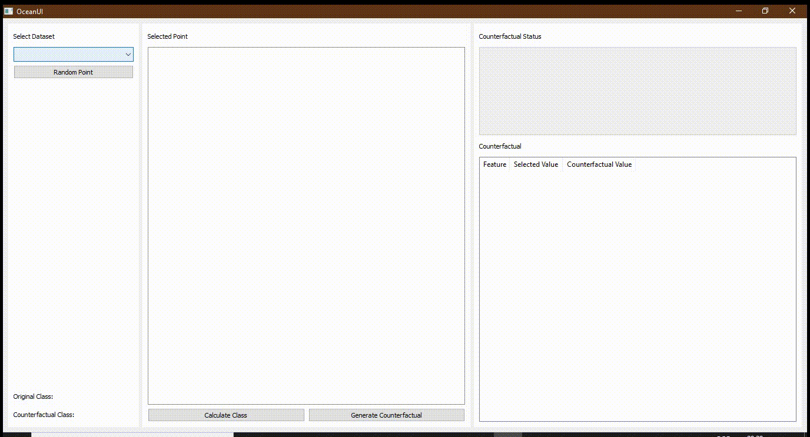

# Description

This project enables to reproduce the numerical experiments used to produce the tables and figures of the paper *Optimal Counterfactual Explanations in Tree Ensemble* by Axel Parmentier and Thibaut Vidal in the *Proceedings of the thirty-eighth International Conference on Machine Learning*, 2021, in press. 

The folder datasets contains the datasets on which the numerical experiments are performed.

The folder src contains all the source code. Launching the script src/runPaperExperiments.py will (after a significant amount of computing time) build all the numerical experiments of the paper.

Once the numerical experiments have been run, the folder counterfactuals contains all the inputs for which counterfactuals are sought. The folder results contains `csv` files with the results of the numerical experiments used to build the figures and tables of the paper.

Author: Axel Parmentier

# Installation

This project requires the gurobi solver. Free academic licenses are available. Please consult:

 - https://www.gurobi.com/academia/academic-program-and-licenses/
 - https://www.gurobi.com/downloads/end-user-license-agreement-academic/

Run the following commands from the project root to install the requirements (you may have to install python and venv before. If you have run the mace experiments, then you must deactivate your venv environment, either by running the `deactivate` command, or by opening a new console.)

```shell
    virtualenv -p python3.8 env
    source env/bin/activate
    pip install -r requirements.txt
    python -m pip install -i https://pypi.gurobi.com gurobipy
```

# Launching experiments

Run the following commands from the project root to launch the numerical experiments:

```shell
    source env/bin/activate
    python src/runPaperExperiments.py
```

At the end of the experiments, the folder results contains the csv files that have been used to produce the figures and tables of the paper, except the benchmark with mace (see Section at the end of this ReadMe).    

# Results files format

The results files are csv files. The meaning of the different columns is described below.

 - trainingSetFile: file containing the training data
 - rf_max_depth: max_depth parameter of the (sklearn) random forest trained, corresponding to the depth of the trees
 - rf_n_estimators: n_estimators parameter of the (sklearn) random forest trained, corresponding to the number of trees in the forest
 - ilfActivated: is the isolation forest taken into account when seeking counterfactuals
 - ilf_max_samples: max_samples parameter of the (sklearn) isolation forest trained (~number of nodes in the trees)
 - ilf_n_estimators:  n_estimators parameter of the (sklearn) isolation forest trained, corresponding to the number of trees in the forest
 - random_state: random number generator seed for sklearn
 - train_score: sklearn train_score of the random forest on the training set
 - test_score: sklearn test_score of the random forest on the test set
 - counterfactualsFile: file containing the counterfactuals sought
 - counterfactual_index: index of the counterfactual in counterfactualsFile
 - useCui: if True, use OAE to solve the model; Otherwise use OCEAN
 - objectiveNorm: 0, 1, or 2: indicates the norm used in objective, l0, l1, or l2 (OAE re-implementation is restricted to norm 1)
 - randomForestMilp.model.status: Gurobi's status at the end
 - randomForestMilp.runTime: Gurobi's runtime
 - randomForestMilp.objValue: Gurobi's objective value
 - plausible: Is the result plausible
 - solution (all the columns starting from this one): optimal solution (using the rescaled features)

# Run Benchmark with mace

Build numerical results using <a href="https://github.com/amirhk/mace">mace</a> by going to folder `maceUpdatedForOceanBenchmark` and following the instructions in `maceUpdatedForOceanBenchmark/ReadMe.md`

You can then get back to this directory, and launch the benchmark with

```shell
    source env/bin/activate
    python src/runBenchmarkWithMace.py
```
# User Interface

Folder `ui` contains the source code of a user interface; this application can help some users by facilitating the interaction with the OCEAN algorithm. The interface needs additional python libraries, which can be installed by running the following commands within the folder:

```shell
    source env/bin/activate
    pip install -r ui/uiRequirements.txt
```

Then, run the following commands to start the interface:

```shell
    source env/bin/activate
    cd ui
    python main.py
```

The following git demonstrates the use of the interface:



Some automated tests can also be done. If you wish to run them, use the following commands:

```shell
    source env/bin/activate
    cd ui
    pytest
```
Or, `pytest -v` to see a detailed version of the test results.
