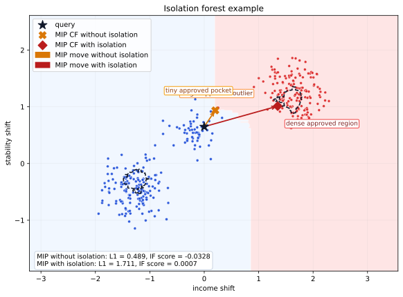

Isolation Forest Example
========================

Suppose you are explaining a rejected application. The classifier has learned
two very different ways to become approved:

- a tiny pocket close to the query, created by a single unusual training point,
- and a larger dense approved region farther to the right.

If we ask only for the shortest valid counterfactual, the optimizer can prefer
the tiny pocket. Adding an isolation forest changes that answer: the
counterfactual must still flip the prediction, but it should also stay in a
region that looks typical with respect to the training data.

The figure below comes from ``examples/isolation_forest_example.py``.

What happens in this example
----------------------------

1. The black star is the rejected query.
2. The gold marker is the MIP counterfactual without isolation. It reaches the
   nearest approved pocket, even though that region is supported by a single
   outlier.
3. The red marker is the MIP counterfactual with ``isolation=...``. It is
   farther away, but it lands in the dense approved region instead.
4. The dashed contour is the zero level of the isolation-forest decision
   function. Crossing to the outside means becoming too isolated.

The figure plots the MIP solutions because their continuous geometry is easier
to read directly. The script also solves the same query with CP and prints both
backends side by side.

Default comparison
------------------

.. list-table:: MIP and CP on the same query
   :header-rows: 1

   * - Backend
     - Isolation
     - Counterfactual
     - :math:`L_1`
     - Isolation score
     - Interpretation
   * - MIP
     - No
     - ``[0.202529, 0.936542]``
     - ``0.489071``
     - ``-0.032840``
     - Shortest move; lands in the tiny approved pocket.
   * - MIP
     - Yes
     - ``[1.349324, 1.012151]``
     - ``1.711474``
     - ``0.000664``
     - Farther move; reaches the dense approved region.
   * - CP
     - No
     - ``[0.202529, 0.936542]``
     - ``0.489071``
     - ``-0.032840``
     - Same qualitative answer on this seed: the nearest pocket wins.
   * - CP
     - Yes
     - ``[1.349324, 1.012151]``
     - ``1.711474``
     - ``0.000664``
     - Same qualitative answer on this seed: the isolation constraint pushes toward the dense region.

Run the example
---------------

.. code-block:: bash

   python examples/isolation_forest_example.py

The script saves the figure directly to
``docs/_static/figures/isolation-forest-example-2d.svg`` and prints the query
plus a comparison table for ``MIP/CP x plain/isolation``.
