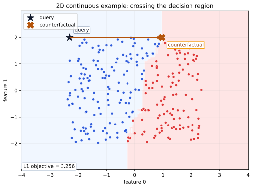
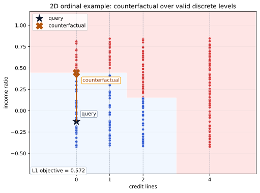

Visual Examples
===============

These examples make the counterfactual search concrete on small two-dimensional
problems. They are not meant to be realistic benchmarks; they are meant to
show what OCEAN is optimizing and how feature typing affects the move.

The plotting script intentionally avoids queries sitting right on the decision
boundary, so the before/after move is visually meaningful.

The figures below are generated by:

.. code-block:: bash

   python examples/plot_2d_examples.py

Continuous 2D Counterfactual
----------------------------

In this first example, both features are continuous. The background colors show
random-forest decision regions, the dark star is the query, and the gold marker
is the counterfactual returned by OCEAN.

What to notice:

- OCEAN does not search for an arbitrary point in the target region; it searches
  for a nearby point that also respects the model structure.
- The arrow is short because the optimization objective is minimizing the
  counterfactual distance.
- The output is still attached to the tree ensemble, not to a smooth surrogate
  boundary.

Ordinal Discrete 2D Counterfactual
----------------------------------

The second example uses one ordered discrete feature on the x-axis and one
continuous feature on the y-axis. The dashed vertical lines mark the valid
ordinal levels.

What to notice:

- The x-axis feature is ordinal: its valid values are ordered and discrete.
- The counterfactual respects those valid levels instead of drifting to an
  arbitrary x-position.
- This is different from an unordered nominal feature, which OCEAN would encode
  as one-hot columns rather than place on a numeric axis.

How this connects to preprocessing
----------------------------------

These figures line up with the feature semantics described in
:doc:`data-preparation`.

- Continuous features can move along a numeric axis.
- Ordered discrete features move between valid levels.
- Unordered nominal categories are one-hot encoded and should not be interpreted
  as having a left-to-right order.

If you want more visual material later, the next useful additions would be a
backend comparison figure or a side-by-side ``L1`` versus ``L2`` illustration.
